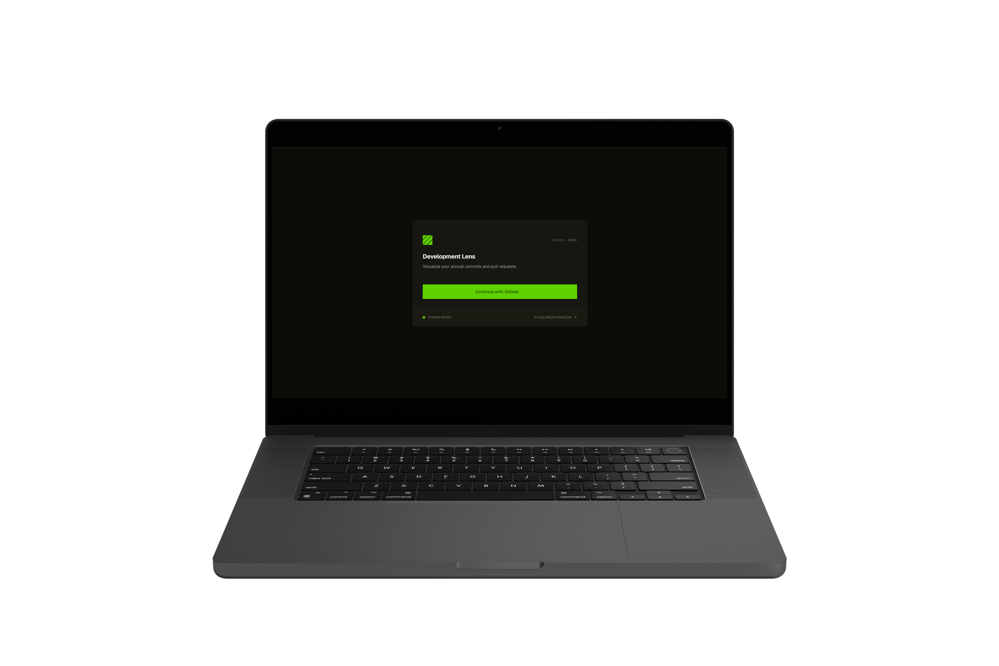
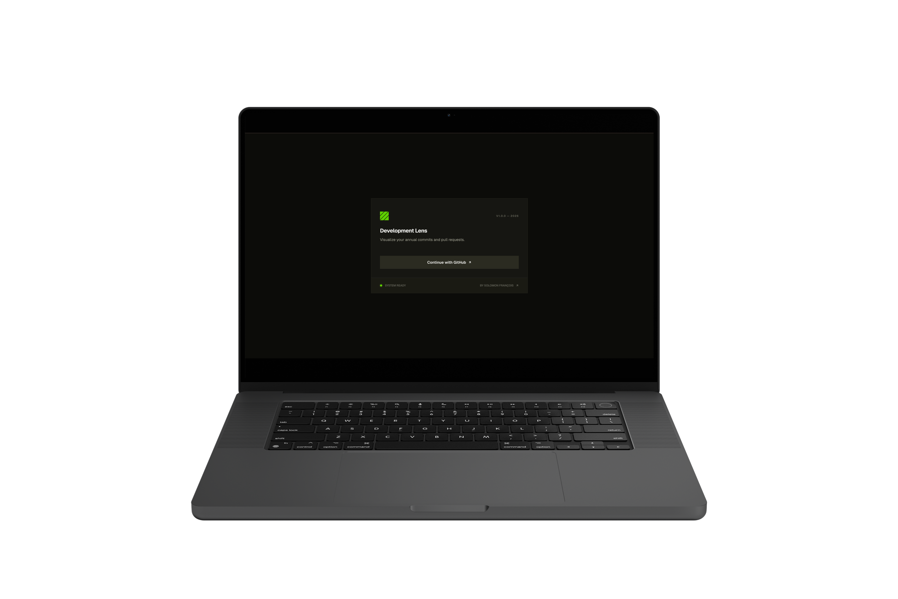
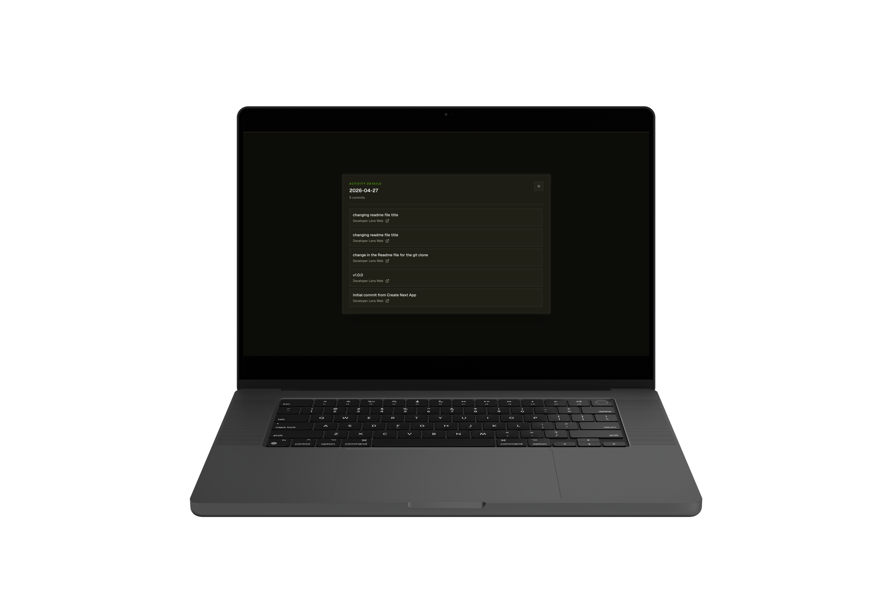
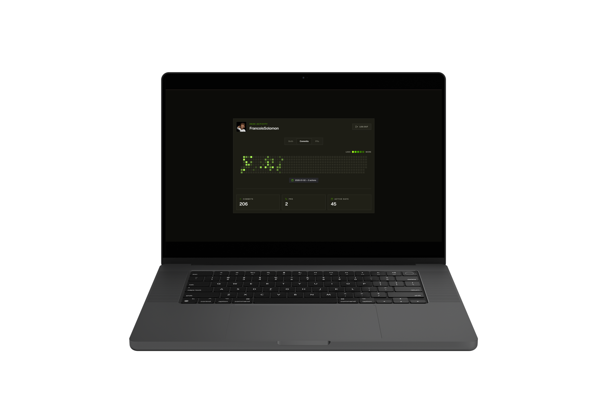
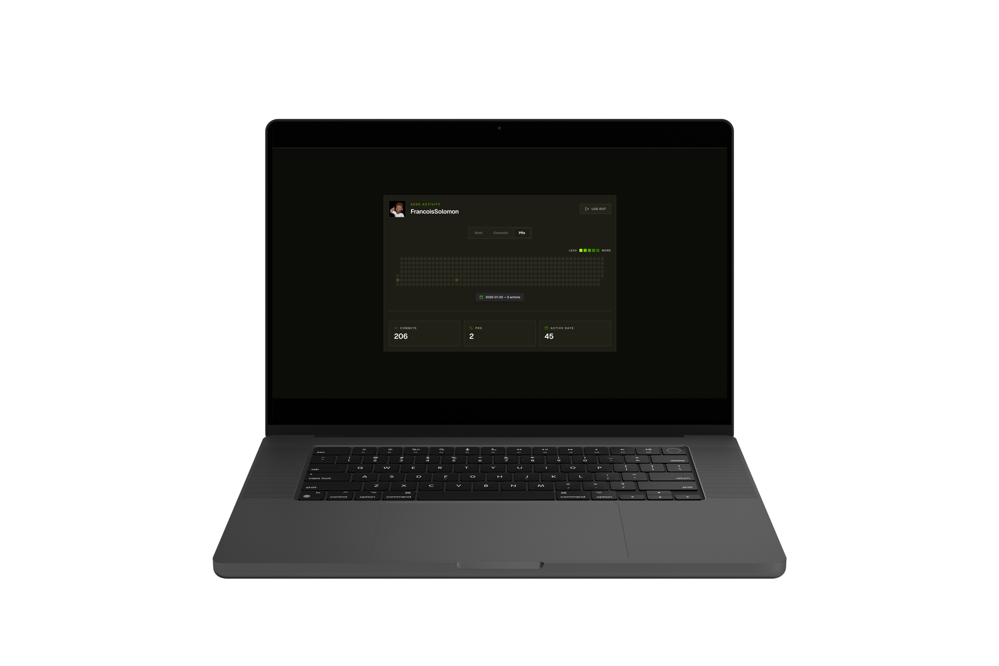

# Developer Lens

**A minimalistic GitHub activity yearbook for developers**

Visualize your commits and pull requests as a clean, interactive yearly heatmap.

## Overview

Developer Lens turns your GitHub activity into a simple visual story of your year.

Instead of focusing on raw stats, it highlights:

- consistency
- activity patterns
- meaningful daily contributions

## Screenshots

<table>
  <tr>
    <td></td>
    <td></td>
  </tr>
  <tr>
    <td></td>
    <td></td>
  </tr>
  <tr>
    <td></td>
    <td></td>
  </tr>
</table>

## Features

- 🔐 GitHub OAuth authentication with NextAuth
- 📊 Interactive yearly contribution heatmap
- 📅 Daily breakdown for commits and pull requests
- 🧠 Smart filtering for commits, PRs, or both
- 🧾 Detailed daily commit viewer
- 🌗 Light/Dark Mode with built-in support from Shadcn UI.
- ⚡ Server-side GitHub data aggregation via `/api/github/activity`
- 🎯 Fully server-rendered dashboard with the App Router

## Tech Stack

- Next.js
- TypeScript
- Tailwind CSS
- Shadcn UI
- NextAuth
- Github OAuth
- GitHub REST API

## Demo

Check out the live demo: [https://developer-lens-web.vercel.app](https://developer-lens-web.vercel.app)

## License

This project is licensed under the [MIT License](./LICENSE).
